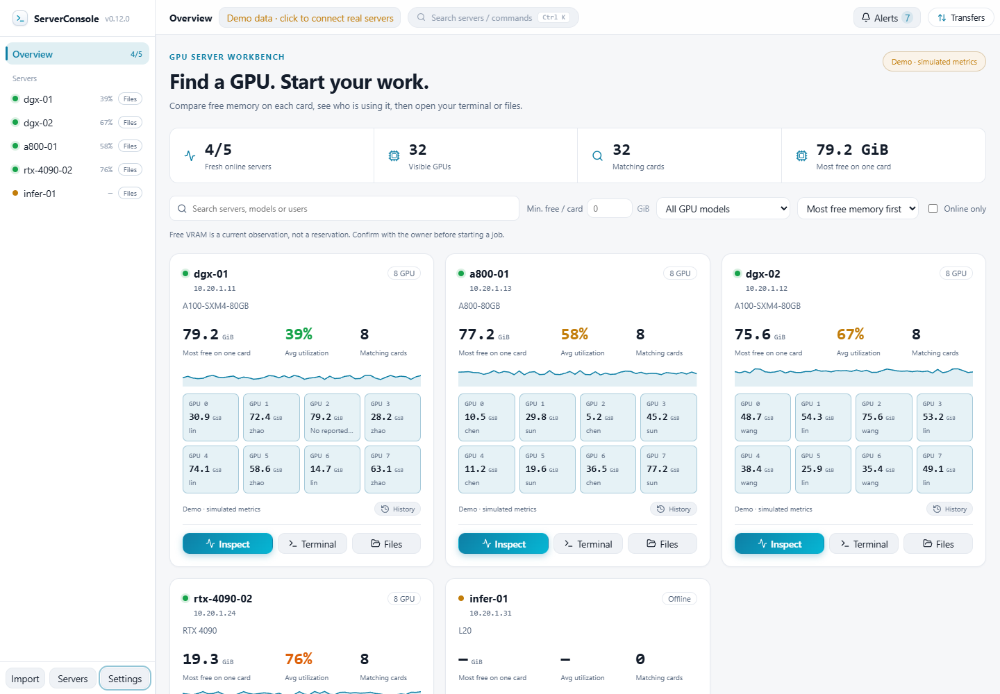
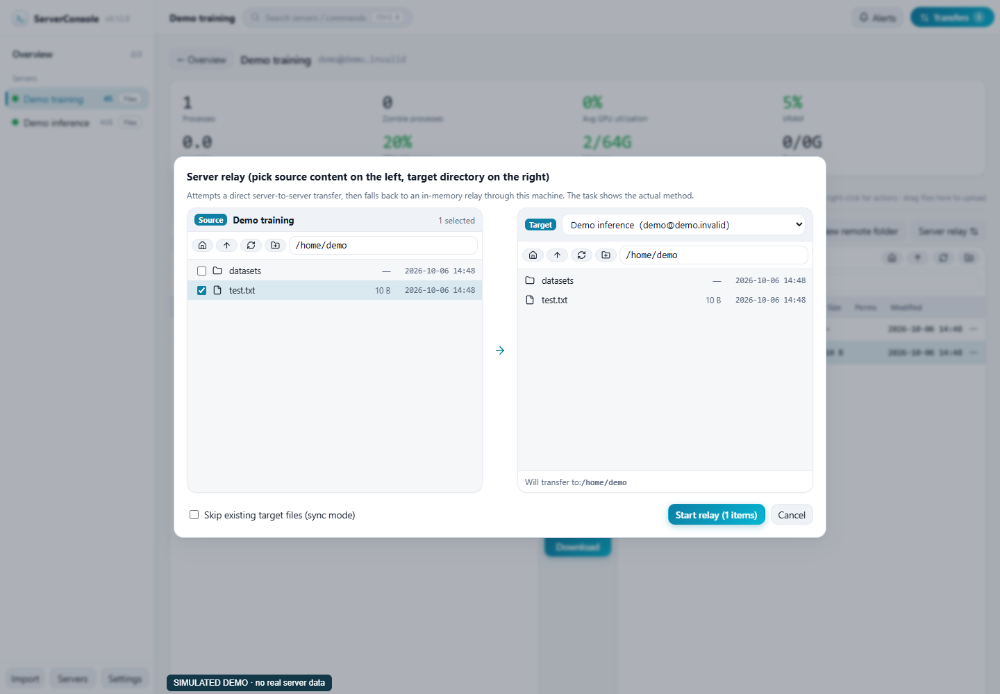
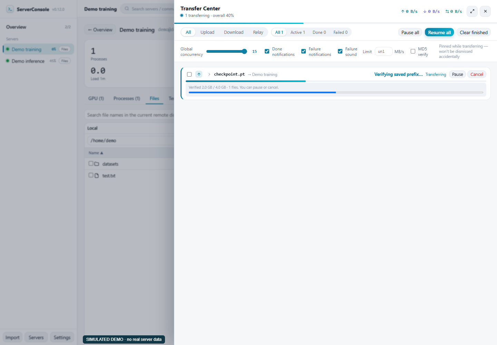

# ServerConsole

**Finde eine GPU mit genügend freiem Speicher, sieh ihre Nutzer und öffne Terminal oder Dateien auf demselben Desktop.**

[English](README.md) | [简体中文](README.zh-CN.md) | [繁體中文](README.zh-TW.md) | [日本語](README.ja.md) | [한국어](README.ko.md) | [Español](README.es.md) | [Français](README.fr.md) | [Deutsch](README.de.md) | [Русский](README.ru.md) | [Português (Brasil)](README.pt-BR.md)

[Herunterladen](https://github.com/Moguifeng-9119/server-console/releases/tag/v0.12.0) · [Problem melden](https://github.com/Moguifeng-9119/server-console/issues)



**Neu in 0.12.0**

Dauerhafte Wiederherstellung und gezielte Bereinigung eigener temporärer Dateien; sichtbarer SHA-256-Prüffortschritt und verständliche Hinweise für alte Aufgaben. Datei-/Relay-Tastaturbedienung, Schutz ungespeicherter Texte und ESLint/Hooks-Prüfungen ergänzt. Alle zehn Sprachdateien haben 635 Schlüssel; maschinell unterstützte Texte benötigen noch vollständige muttersprachliche Prüfung.

Aktuelle Nachweise: echte SSH/SFTP-Wiederherstellung auf einem Linux-Host mit sechs H100-GPUs. Der zweite Testhost ist nicht erreichbar; echtes serverübergreifendes rsync bleibt ungeprüft. Die folgenden 0.11.1-Zahlen sind historische Ergebnisse. [0.12.0](docs/VALIDATION-0.12.0.md).


<p> </p>

Die Bilder zeigen v0.12.0 mit simulierten Daten. v0.12.0 bietet Windows x64 Portable, Linux x86_64 AppImage und macOS Universal-DMG mit SHA-256-Prüfsummen. Pakete sind unsigniert; macOS ist nicht notarisiert.

[Detailed usage and recovery (English)](docs/USER-GUIDE.md) · [简体中文](docs/USER-GUIDE.zh-CN.md)

## Funktionen

Ein persönliches Werkzeug für gemeinsam genutzte **Linux-/NVIDIA-GPU-Server**, per SSH ohne Überwachungsagent auf dem Server.

- Nach freien GiB pro GPU, Modell und Nutzer filtern, nach freiem Speicher sortieren und direkt Überwachung, Terminal oder Dateien öffnen.
- Prozesse, mehrere GPUs pro PID, Linux-CPU-Zeitdifferenzen, Datenalter und zeitgestempelte Historie mit Messlücken sehen.
- Transferwarteschlange, geprüfte Fortsetzung, Wiederherstellung nach Neustart, direkter rsync oder SFTP-Weiterleitung; SSH config, Gruppen, ProxyJump, Befehle und Portweiterleitung.
- Aktive/beendete Alarme und höchstens zwei schließbare Meldungen; die Demo sendet keine externen Störungsmeldungen.

Keine Teamkonten, Reservierungen, Cluster-Scheduling, AMD/Intel-GPU-Telemetrie oder vollständige NVML-Diagnostik. Freier Speicher ist keine Reservierung.

## Erste Schritte

Lade dein Paket, teste und ergänze einen Server oder importiere SSH config. GPU-Werte brauchen nvidia-smi, Systemwerte Linux /proc. Quellcode mit Node.js 22 und npm:

```sh
git clone https://github.com/Moguifeng-9119/server-console.git
cd server-console
npm ci
npm run dev
```

Der Browser ist eine gekennzeichnete Simulation. Echtes SSH, Zugangsdaten, Terminal und SFTP benötigen den Desktop-Prozess:

```sh
npm run electron:dev
```

Gib die nötigen freien GiB pro Karte an und wähle Modell oder Nutzer. Einstellungen sind thematisch gruppiert. Ctrl/Cmd+K öffnet die Palette; die wichtigsten Dialoge unterstützen Tab, Shift+Tab, Escape und Fokuswiederherstellung.

## Transfers und Zugangsdaten

- Keine beliebige Zieldatei als Fortsetzung: eigene temporäre Dateien und SHA-256-Vergleich des vollständigen Präfixes.
- SFTP prüft Bytes, Quellgröße und Änderungszeit vor dem Ersetzen, serialisiert überschneidende Ziele und behält Daten bei Fehlern. Fehlgeschlagene Bereinigung behält den Wiederherstellungseintrag und meldet den Fehler.
- Optionales MD5 vor dem Ersetzen einzelner Dateien; Verzeichnisse und Weiterleitungen werden nicht als MD5-geprüft bezeichnet.
- Direkttransfer benötigt rsync auf beiden Seiten und Erreichbarkeit von Quelle zu Ziel, mit temporärem SSH-Schlüssel und vertrauenswürdigem Fingerabdruck; sonst gestaffelte SFTP-Weiterleitung. Direkt überschreibende tar/scp-Ausweichwege sind deaktiviert.
- Sicherer OS-Schlüsselspeicher verschlüsselt Passwörter und Passphrasen. Fehlt er oder ist er Linux basic_text, bleiben neue Geheimnisse nur im Sitzungsspeicher und werden nach Neustart erneut eingegeben. Der echte Modus wird angezeigt; private Schlüssel behalten ihren Pfad.

Größe/Zeit sperren keine parallel veränderte Quelle. Siehe [Sicherheit](SECURITY.md); rsync zwischen echten Servern ist noch nicht validiert.

## Validierung

v0.11.1 bestand auf Windows/Linux/macOS jeweils Typprüfung, 84 Regressionstests, SFTP-Smoke, Build und 22 Browserprüfungen. Jede gepackte Anwendung bestand 16 native Prüfungen: IPC, lokale SSH-Shell, Größenänderung, Weiterleitung und authentifizierter Neustart.

Windows DPAPI wurde real getestet. macOS nutzt MockKeychain, keinen Nachweis für echten Keychain; Ausführung auf arm64, nicht Intel. Linux prüft Sitzungsspeicherung ohne sicheren Speicher. Physische GPU/MIG, Remote-PTY, produktiver rsync/Netzdurchsatz, echte macOS-/Linux-Schlüsselspeicher, Installer und Updates brauchen weitere Tests. Der Benchmark mit 10/30 simulierten SSH-Sitzungen belegt keine Clusterleistung oder prozentuale Einsparung.

## Entwicklung

React, TypeScript, Electron, Vite und ssh2; genaue Versionen in [package.json](package.json) und Lockdatei. Kommandos:

```sh
npm run lint
npm run typecheck
npm test
npm run smoke
npm run build
npx playwright-core install chromium
npm run test:ui
npm run test:workflow
npm run benchmark
```

SC_ELECTRON_PATH auf die aktuelle entpackte Anwendung setzen, dann npm run e2e:terminal. dist:win:lite, dist:win:nsis, dist:linux und dist:mac deaktivieren automatische Veröffentlichung. Die [Paket-CI](.github/workflows/package.yml) testet vor dem Hochladen. ESLint und React-Hooks sind konfiguriert; npm run lint ist Teil der CI.

## Sprachen und Beiträge

README-Anleitungen in zehn Sprachen; die Oberfläche hat zehn vollständige Schlüsseldateien und lädt sie bei Bedarf. Nicht alle Formulierungen sind muttersprachlich geprüft. [LOCALIZATION](docs/LOCALIZATION.md).

[Nachweise](docs/VALIDATION-0.11.1.md) · [Messmethode](docs/BENCHMARKS.md) · [Architektur](docs/ARCHITECTURE.md) · [Beitragen](CONTRIBUTING.md) · [Roadmap](docs/ROADMAP.md) · [Änderungen](CHANGELOG.md) · [MIT-Lizenz](LICENSE)
