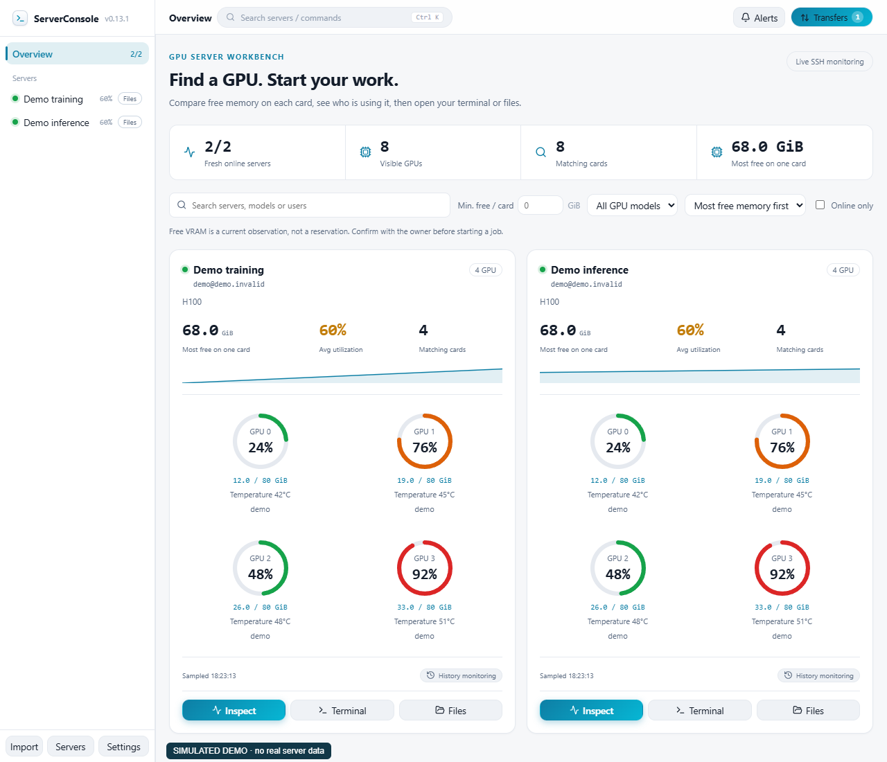

# ServerConsole

**Find a GPU with enough free memory, see who is using it, and open your terminal or files from one desktop.**

[English](README.md) | [简体中文](README.zh-CN.md) | [繁體中文](README.zh-TW.md) | [日本語](README.ja.md) | [한국어](README.ko.md) | [Español](README.es.md) | [Français](README.fr.md) | [Deutsch](README.de.md) | [Русский](README.ru.md) | [Português (Brasil)](README.pt-BR.md)

[Download desktop releases](https://github.com/Moguifeng-9119/server-console/releases) · [Report a problem](https://github.com/Moguifeng-9119/server-console/issues) · [Contribute](CONTRIBUTING.md)

**0.13.2 source/local update:** Overview GPU grids now use four columns, including narrow cards. [Local validation](docs/VALIDATION-0.13.2.md).

**0.13.1:** Circular per-GPU gauges, immediate cached server panels, retained file panes and visible history ranges: 30 minutes, 1 hour, 12 hours, 1 day and 1 week. SQLite automatically expires raw samples after 24 hours and minute summaries after 30 days. Monitoring runs while the desktop app is open. Install `ServerConsole-Setup-0.13.1.exe`. [Validation and storage measurement](docs/VALIDATION-0.13.1.md)

**Windows downloads are unsigned. SmartScreen may show a warning. Compare the download SHA-256 with the release checksum file.**





*The overview screenshot shows v0.13.1; the history screenshot shows v0.13.0, both with explicitly simulated metrics; older transfer screenshots remain from v0.12.0. [v0.13.1](https://github.com/Moguifeng-9119/server-console/releases/tag/v0.13.1) provides Windows x64 installer, Linux x86_64 AppImage and macOS universal DMG packages with SHA-256 checksums. See the [latest validation ledger](docs/VALIDATION-0.13.1.md) for platform coverage.*

[Detailed usage, transfer decisions, recovery and source map (English)](docs/USER-GUIDE.md) · [简体中文](docs/USER-GUIDE.zh-CN.md)

**New in 0.12.0:** durable staging recovery/cleanup, visible SHA-256 prefix progress, legacy task explanations, keyboard file/relay controls, draft protection and complete ten-language key resources.


<p> </p>

## Why use it?

ServerConsole is designed for people sharing **Linux servers with NVIDIA GPUs**. It connects from your computer through SSH, combines resource discovery with a terminal and dual-pane SFTP, and needs no monitoring agent on the remote host.

| A task you need to complete | What the app provides |
| --- | --- |
| Find one card with 40 GiB free | Per-card memory filtering, GPU model selection, owner search, most-free-first sorting |
| Understand why a server is busy | GPU/process metrics, owners, multi-GPU PID associations, Linux CPU counters |
| Start work without switching tools | Terminal/file shortcuts, SSH config import, groups, ProxyJump, quick commands, port forwarding |
| Move experiments and datasets | Queued uploads/downloads, verified resume prefixes, restart recovery, staged replacement, rsync direct transfer or SFTP relay |
| Judge whether a reading is recent | Actual sample timestamps, stale indicators, timestamped history with gaps |
| Track anomalies without flooding the screen | Grouped active/resolved alerts, two dismissible toasts, no external anomaly notifications in demo mode |

It is a personal desktop workbench. Team accounts, resource reservations, cluster scheduling, AMD/Intel GPU telemetry and a full NVML diagnostic stack are outside the current scope. Free VRAM is an observation, not a reservation.

<p> </p>

## Get started

**Desktop users:** choose an artifact for your OS in [Releases](https://github.com/Moguifeng-9119/server-console/releases). Only attached artifacts count as published packages; macOS/Linux build scripts alone do not prove support. Open **Servers**, test a connection, then add it, or import existing SSH config entries. GPU metrics need working nvidia-smi; Linux system metrics use /proc.

**Try the interface from source** with Node.js 22 and npm:

```sh
git clone https://github.com/Moguifeng-9119/server-console.git
cd server-console
npm ci
npm run dev
```

The browser is a clearly labelled demo. Real SSH, credentials, terminals and SFTP require the desktop process:

```sh
npm run electron:dev
```

Set the minimum **free GiB per card**, choose a model or search an owner, then use **Inspect**, **Terminal** or **Files**. Settings are grouped into Appearance, Monitoring, Security, Workflow and Activity & help. Ctrl/Cmd+K opens commands; dialogs support Tab, Shift+Tab and Escape.

## Transfer integrity and credentials

Staging ownership is committed before writes so crashes restore actionable tasks. Cleanup intent persists before unlink and retries after reconnect; unknown legacy stages are kept for manual inspection. Full SHA-256 prefix checking has separate progress but still reads both complete prefixes.

- An arbitrary existing destination is never used as a resume prefix. Uploads, downloads and local relays use task-owned staging; complete SHA-256 prefix comparisons decide whether staged bytes can be resumed.
- SFTP transfers check byte counts and source size/mtime before replacing the destination. Overlapping target paths are queued. Failures retain staging for retry; cancel/remove clean tracked staging. Cleanup failures retain the recovery record and report an error.
- Optional MD5 verification runs **before replacement** for single-file uploads/downloads. The UI distinguishes verified, failed, unavailable and not requested. Directory/relay tasks do not claim MD5 verification.
- Direct relay requires rsync on both ends and source-to-destination reachability. It uses a temporary SSH key and trusted destination fingerprint. Otherwise it uses staged local SFTP; streaming tar/scp overwrite fallbacks are disabled.
- Passwords/passphrases use OS encryption when a secure backend is available. Otherwise, including Linux basic_text, new credentials stay **in session memory** and must be entered again after restart. Security settings show the actual backend and migration errors. Private keys stay at their existing paths.

Read [security behavior and limitations](SECURITY.md). Size/mtime checks do not lock a concurrently rewritten source. Exact owned direct keys and scratch are journaled before remote mutations and cleaned after reconnect; unknown older resources remain for manual inspection.

## Development and evidence

```sh
npm run lint
npm run typecheck
npm test
npm run smoke
npm run build
npx playwright-core install chromium  # if no supported local Chrome is available
npm run test:ui
npm run test:workflow
npm run benchmark
```

The current source passes 179 regressions, type checking, ESLint/Hooks and two loopback SSH/SFTP byte checks. Production browser checks cover the workbench, file/editor/relay, all ten locales, resource-load failures and keyboard language races. A current packaged Windows build passed 22 native terminal/IPC checks and 36 native layout checks at 100/125/150% scaling. Two real Linux hosts passed 16 MiB upload and rsync relay SHA-256 checks after separately forcing the entire Electron main process to terminate; restart restored prefix-verified upload recovery and removed exact old direct keys/scratch. These bounded checks do not establish production fleet or 100 GB performance.

The stack is React 18, TypeScript, Electron, Vite and ssh2; exact versions are in [package.json](package.json) and the lockfile. See [architecture](docs/ARCHITECTURE.md), [latest validation evidence](docs/VALIDATION-0.13.1.md) and [benchmark methodology](docs/BENCHMARKS.md). ESLint/Hooks and behavior/browser checks run in CI.

Build targets: dist:win:lite, dist:win:nsis, dist:linux and dist:mac. [Manual packaging CI](.github/workflows/package.yml) uploads unsigned artifacts for review and does not publish a release. The current platform/package results are recorded in the validation ledger. Signing/notarization, installers/updates, Intel macOS execution and real macOS/Linux key stores remain unverified; macOS automation uses MockKeychain.

## Languages and contributing

README usage guides have ten substantive language pages with shared navigation. The app’s ten locale files each contain 702 keys with matching interpolation, and older hardcoded business labels have been migrated. Non-English locales load on demand. Other languages include machine-assisted drafts; full native-speaker review remains pending. Remote command output and backend details retain their original language. See [localization status](docs/LOCALIZATION.md).

[Contribution guide](CONTRIBUTING.md) · [Changelog](CHANGELOG.md) · [Roadmap](docs/ROADMAP.md) · [MIT License](LICENSE)
