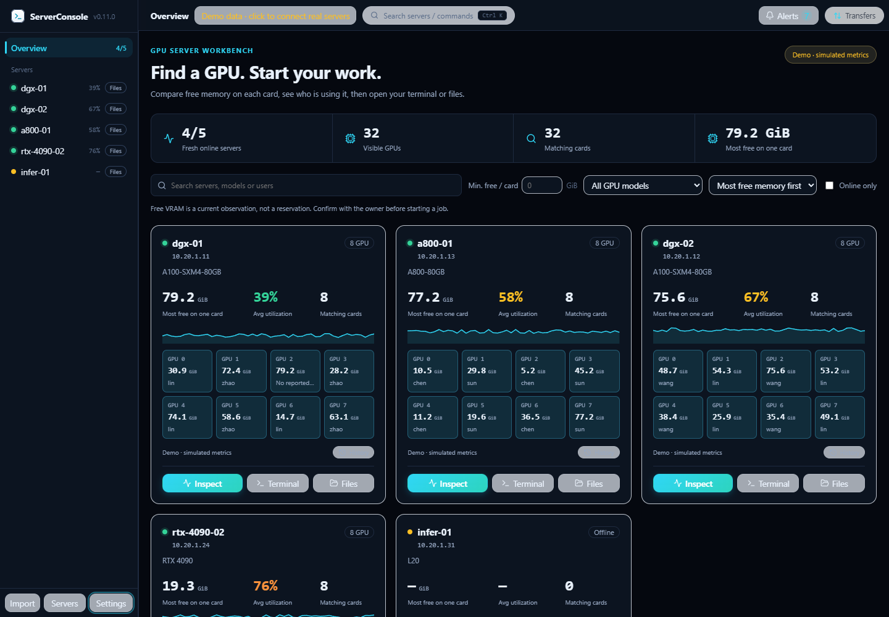
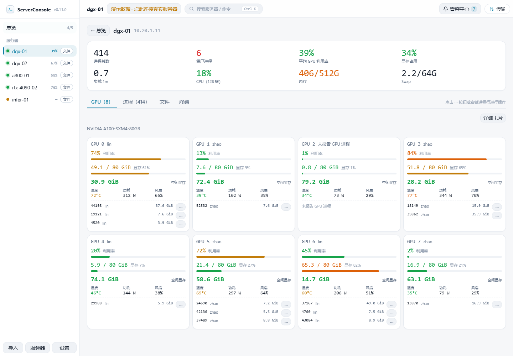

# ServerConsole

**Find a GPU with enough free memory, see who is using it, and open your terminal or files from one desktop.**

[English](README.md) | [简体中文](README.zh-CN.md) | [繁體中文](README.zh-TW.md) | [日本語](README.ja.md) | [한국어](README.ko.md) | [Español](README.es.md) | [Français](README.fr.md) | [Deutsch](README.de.md) | [Русский](README.ru.md) | [Português (Brasil)](README.pt-BR.md)

[Download desktop releases](https://github.com/Moguifeng-9119/server-console/releases) · [Report a problem](https://github.com/Moguifeng-9119/server-console/issues) · [Contribute](CONTRIBUTING.md)


*Screenshots show v0.11.0 with explicitly simulated metrics. [v0.11.1](https://github.com/Moguifeng-9119/server-console/releases/tag/v0.11.1) provides Windows x64 portable, Linux x86_64 AppImage and macOS universal DMG packages with SHA-256 checksums. See the [latest validation ledger](docs/VALIDATION-0.11.1.md) for platform coverage.*

## Why use it?

ServerConsole is designed for people sharing **Linux servers with NVIDIA GPUs**. It connects from your computer through SSH, combines resource discovery with a terminal and dual-pane SFTP, and needs no monitoring agent on the remote host.

| A task you need to complete | What the app provides |
| --- | --- |
| Find one card with 40 GiB free | Per-card memory filtering, GPU model selection, owner search, most-free-first sorting |
| Understand why a server is busy | GPU/process metrics, owners, multi-GPU PID associations, Linux CPU counters |
| Start work without switching tools | Terminal/file shortcuts, SSH config import, groups, ProxyJump, quick commands, port forwarding |
| Move experiments and datasets | Queued uploads/downloads, verified resume prefixes, restart recovery, staged replacement, rsync direct transfer or SFTP relay |
| Judge whether a reading is recent | Actual sample timestamps, stale indicators, timestamped history with gaps |
| Track anomalies without flooding the screen | Grouped active/resolved alerts, two dismissible toasts, no external anomaly notifications in demo mode |

It is a personal desktop workbench. Team accounts, resource reservations, cluster scheduling, AMD/Intel GPU telemetry and a full NVML diagnostic stack are outside the current scope. Free VRAM is an observation, not a reservation.

<p> </p>

## Get started

**Desktop users:** choose an artifact for your OS in [Releases](https://github.com/Moguifeng-9119/server-console/releases). Only attached artifacts count as published packages; macOS/Linux build scripts alone do not prove support. Open **Servers**, test a connection, then add it, or import existing SSH config entries. GPU metrics need working nvidia-smi; Linux system metrics use /proc.

**Try the interface from source** with Node.js 22 and npm:

```sh
git clone https://github.com/Moguifeng-9119/server-console.git
cd server-console
npm ci
npm run dev
```

The browser is a clearly labelled demo. Real SSH, credentials, terminals and SFTP require the desktop process:

```sh
npm run electron:dev
```

Set the minimum **free GiB per card**, choose a model or search an owner, then use **Inspect**, **Terminal** or **Files**. Settings are grouped into Appearance, Monitoring, Security, Workflow and Activity & help. Ctrl/Cmd+K opens commands; dialogs support Tab, Shift+Tab and Escape.

## Transfer integrity and credentials

- An arbitrary existing destination is never used as a resume prefix. Uploads, downloads and local relays use task-owned staging; complete SHA-256 prefix comparisons decide whether staged bytes can be resumed.
- SFTP transfers check byte counts and source size/mtime before replacing the destination. Overlapping target paths are queued. Failures retain staging for retry; cancel/remove clean tracked staging. Cleanup failures retain the recovery record and report an error.
- Optional MD5 verification runs **before replacement** for single-file uploads/downloads. The UI distinguishes verified, failed, unavailable and not requested. Directory/relay tasks do not claim MD5 verification.
- Direct relay requires rsync on both ends and source-to-destination reachability. It uses a temporary SSH key and trusted destination fingerprint. Otherwise it uses staged local SFTP; streaming tar/scp overwrite fallbacks are disabled.
- Passwords/passphrases use OS encryption when a secure backend is available. Otherwise, including Linux basic_text, new credentials stay **in session memory** and must be entered again after restart. Security settings show the actual backend and migration errors. Private keys stay at their existing paths.

Read [security behavior and limitations](SECURITY.md). Size/mtime checks do not lock a concurrently rewritten source. Real remote rsync has not been validated in this source change.

## Development and evidence

```sh
npm run typecheck
npm test
npm run smoke
npm run build
npx playwright-core install chromium  # if no supported local Chrome is available
npm run test:ui
npm run benchmark
```

Typecheck covers strict renderer TypeScript and Electron checkJs. Smoke tests use two loopback fake SSH servers with real SFTP transport. UI checks use the production renderer with simulated metrics. v0.11.1 passed source CI on Windows/Linux/macOS with 84 regression tests and 22 browser checks per platform. The package workflow passed 16 native checks per platform, including IPC, local SSH shell, resize, forwarding and authenticated restart; set SC_ELECTRON_PATH to the current unpacked app executable and run npm run e2e:terminal. Benchmarks use 10/30 synthetic loopback SSH sessions; they make no real-cluster performance or percentage-savings promise.

The stack is React 18, TypeScript, Electron, Vite and ssh2; exact versions are in [package.json](package.json) and the lockfile. See [architecture](docs/ARCHITECTURE.md), [latest validation evidence](docs/VALIDATION-0.11.1.md) and [benchmark methodology](docs/BENCHMARKS.md). There is no current ESLint/Hooks lint result.

Build targets: dist:win:lite, dist:win:nsis, dist:linux and dist:mac. [Manual packaging CI](.github/workflows/package.yml) uploads unsigned artifacts for review and does not publish a release. The v0.11.1 three-platform builds and native checks passed. Signing/notarization, installers/updates, Intel macOS execution and real macOS/Linux key stores remain unverified; macOS automation uses MockKeychain.

## Languages and contributing

README usage guides are available in ten languages using the navigation at the top of each page. Application localization is separate. The selector retains English, 简体中文, 繁體中文, 日本語, 한국어, Español, Français, Deutsch, Русский and Português (Brasil). The redesigned workbench is maintained in English and Simplified Chinese; untranslated new strings fall back to English. Older screens still need translation work. See [localization status](docs/LOCALIZATION.md) and the [original assessment follow-up (Chinese)](docs/ASSESSMENT-STATUS.zh-CN.md).

[Contribution guide](CONTRIBUTING.md) · [Changelog](CHANGELOG.md) · [Roadmap](docs/ROADMAP.md) · [MIT License](LICENSE)
