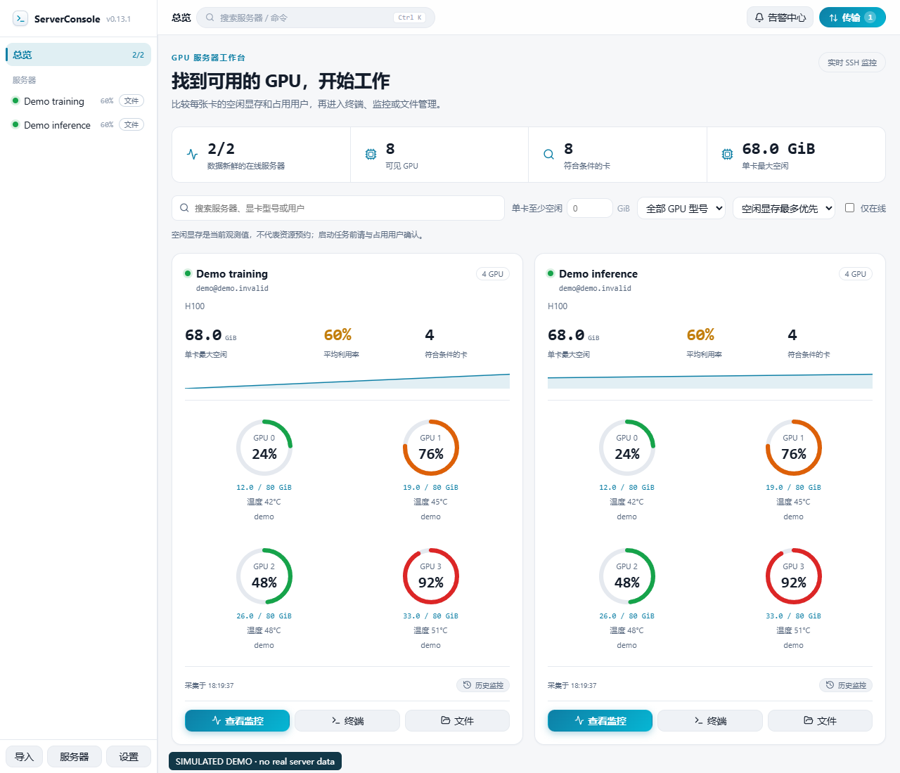
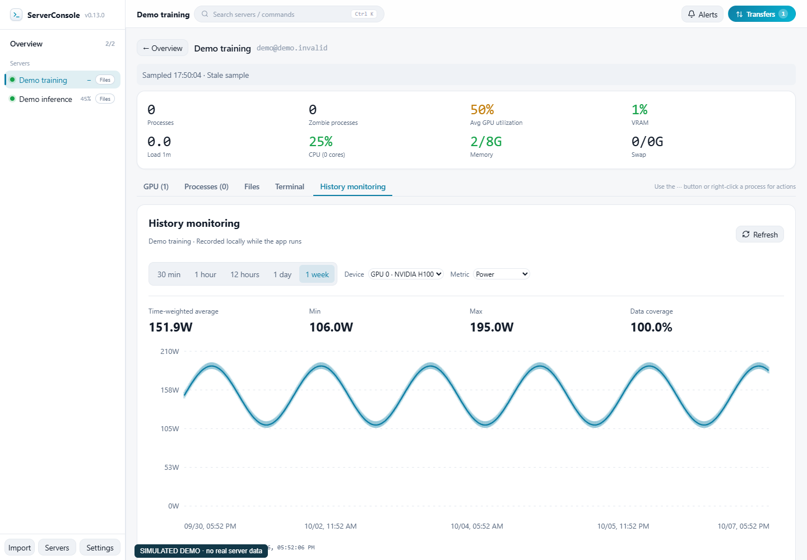

# ServerConsole

**找到显存够用的 GPU，看清占用用户，从一个桌面直接进入终端、监控和文件管理。**

[English](README.md) | [简体中文](README.zh-CN.md) | [繁體中文](README.zh-TW.md) | [日本語](README.ja.md) | [한국어](README.ko.md) | [Español](README.es.md) | [Français](README.fr.md) | [Deutsch](README.de.md) | [Русский](README.ru.md) | [Português (Brasil)](README.pt-BR.md)

[下载桌面版本](https://github.com/Moguifeng-9119/server-console/releases) · [反馈问题](https://github.com/Moguifeng-9119/server-console/issues) · [参与贡献](CONTRIBUTING.md)

**0.13.2 源码／本地安装包更新：**主页 GPU 固定每行 4 张，窄卡片缩小圆环和间距，仍保持四列。[本地验证](docs/VALIDATION-0.13.2.md)。

**0.13.1：**主页逐卡圆形 GPU 仪表默认每行 2 个，宽卡片每行 4 个；切换服务器先显示缓存、后台独立刷新，保留已打开的文件面板。总览卡片和服务器页均有“历史监控”入口，可选 30 分钟、1 小时、半天、1 天、1 周。SQLite 自动清理超过 24 小时的原始采样和超过 30 天的分钟汇总；应用运行时持续采集。安装 `ServerConsole-Setup-0.13.1.exe`。[验证与存储实测](docs/VALIDATION-0.13.1.md)

**Windows 下载包未签名，SmartScreen 可能显示警告。请使用 Release 附带的 SHA-256 文件核对下载内容。**






*主页截图来自 v0.13.1，历史监控图来自 v0.13.0，旧传输截图来自 v0.12.0，均使用明确标注的模拟数据。[v0.13.1](https://github.com/Moguifeng-9119/server-console/releases/tag/v0.13.1) 提供 Windows x64 安装版、Linux x86_64 AppImage 和 macOS 通用 DMG，以及 SHA-256 校验文件。各系统的验证范围见[最新验证记录](docs/VALIDATION-0.13.1.md)。*

详细操作、传输决策流程、崩溃恢复和源码布局见[使用与恢复指南](docs/USER-GUIDE.zh-CN.md)。

**0.12.0 新增：**暂存文件持久化恢复与清理、SHA-256 校验进度、旧任务说明、文件/互传键盘操作、草稿保护和十语言完整键资源。


<p> </p>

## 适合解决什么问题？

ServerConsole 面向共享 **Linux / NVIDIA GPU 服务器**的科研与工程用户。从本机通过 SSH 连接，集中查看资源、打开终端、管理双栏 SFTP 文件，无需在远端安装监控 Agent。

| 你的任务 | 项目提供的能力 |
| --- | --- |
| 找一张至少空闲 40 GiB 的卡 | 单卡显存筛选、GPU 型号、占用用户搜索、空闲最多优先排序 |
| 看清资源被谁占用 | GPU 与进程信息、用户关联、同一个 PID 的多卡展示、Linux CPU 时间差 |
| 找到资源后开始工作 | 终端/文件快捷入口、SSH config 导入、分组、ProxyJump、快速命令、端口转发 |
| 迁移实验和数据集 | 队列上传/下载、验证断点前缀、跨重启恢复、临时文件替换、rsync 直传或 SFTP 中转 |
| 判断数据是否可信 | 采集时间、过期提示、按真实时间戳绘制且保留缺采样间隔的历史曲线 |
| 追踪异常 | 按服务器与类型归并告警、区分未恢复/已恢复、最多两个可关闭提示；演示模式不发外部异常通知 |

当前定位是个人桌面工作台。团队账户、资源预约、集群调度、AMD/Intel GPU 和完整 NVML 诊断尚未提供。空闲显存是观测值，不代表已预约或可独占。

<p> </p>

## 开始使用

**下载桌面应用：**在 [Releases](https://github.com/Moguifeng-9119/server-console/releases) 选择实际存在的系统附件。有构建脚本不等于已发布并验证对应安装包。进入 **服务器**，先测试连接再添加，或导入现有 SSH config。GPU 指标需要远端可运行 nvidia-smi，系统指标使用 Linux /proc。

**从源码体验界面：**需要 Node.js 22 与 npm。

```sh
git clone https://github.com/Moguifeng-9119/server-console.git
cd server-console
npm ci
npm run dev
```

浏览器里是标明“模拟数据”的演示。真实 SSH、终端、凭据存储和 SFTP 需要桌面主进程：

```sh
npm run electron:dev
```

填写“**单卡至少空闲**”，选择型号或输入用户，再点击 **查看监控 / 终端 / 文件**。设置分为外观、监控、安全、工作流、记录与帮助；Ctrl/Cmd+K 打开命令面板，弹窗支持 Tab、Shift+Tab、Escape 与关闭后焦点恢复。

## 传输与凭据的实际保证

暂存文件在写入前提交归属记录，崩溃后恢复可操作任务。清理意图在删除前持久化，断连后重连重试；未知旧 stage 保留供人工核查。完整 SHA-256 前缀校验有独立进度，但仍需读取两边前缀。

- 任意已有目标文件不再被当成断点。上传、下载和本机中转使用独立任务临时文件，只有完整 SHA-256 前缀一致时才续传。
- SFTP 检查预期字节数和源文件前后的大小/修改时间，通过后才替换目标。不同路径写法与目录/子文件目标冲突会进入队列。失败保留临时文件以便重试；取消/移除清理任务跟踪的临时文件，清理失败则保留记录并显示原因。
- 可选 MD5 在单文件上传/下载**替换目标前**执行，界面明确区分已校验、失败、无法校验、未请求。目录和互传不会冒称已通过 MD5。
- 服务器直传要求两端 rsync 和源到目标的可达性，使用临时密钥与已信任目标指纹。不能直传时回退本机 SFTP；不再使用传输中直接覆盖目标的 tar/scp 回退。
- 安全系统密钥库可用时，密码与私钥口令由 OS 加密保存；不可用或 Linux basic_text 时，新凭据只留在当前会话，重启后需重新输入。安全页显示实际后端与迁移错误；私钥保留在原有路径。

[SECURITY.md](SECURITY.md) 记录完整边界。大小与修改时间检查不能锁住持续变化的源文件。直传密钥和目录在远端操作前提交精确归属记录，重连后清理；未知旧资源仍保留供人工检查。

## 开发、测试与构建

```sh
npm run lint
npm run typecheck
npm test
npm run smoke
npm run build
npx playwright-core install chromium  # 无可用本地 Chrome 时
npm run test:ui
npm run test:workflow
npm run benchmark
```

当前源码通过 164 项回归、类型检查、ESLint/Hooks 和双本机 SSH/SFTP 字节检查；生产浏览器覆盖工作台、文件/编辑/互传、十语言，以及语言资源失败和真实键盘竞争操作。新版 Windows 包通过 16 项原生终端与 36 项原生布局检查，涵盖 100/125/150% 缩放。两台真实 Linux 主机完成 16 MiB 上传和 rsync 互传 SHA-256；分别强杀整个 Electron 主进程后，上传恢复包含前缀校验，直传重连会清除原有的精确临时密钥和目录。这些有界测试不代表生产集群或 100 GB 性能已验证。

准确依赖版本以 [package.json](package.json) 与锁文件为准。参阅 [架构](docs/ARCHITECTURE.md)、[最新验证证据](docs/VALIDATION-0.13.1.md)、[基准说明](docs/BENCHMARKS.md)。ESLint/Hooks 与行为/浏览器检查在 CI 执行。

构建命令为 dist:win:lite、dist:win:nsis、dist:linux、dist:mac。[手动打包 CI](.github/workflows/package.yml) 在各平台构建后运行原生检查，再上传未签名构建；所有命令显式关闭自动发布。发布包未签名，macOS 未公证；真实硬件、真实系统密钥库及安装器验证范围见[验证记录](docs/VALIDATION-0.13.1.md)。

## 语言、贡献与后续方向

README 十页都有实质使用说明与相互导航。界面十语言各 702 个键，插值一致，旧硬编码中文已迁移，语言按需加载。非中英文包含机器辅助初稿，完整母语审校仍待完成；远端命令输出与后端详细错误保留原语言。详见 [国际化状态](docs/LOCALIZATION.md)。

欢迎按 [贡献指南](CONTRIBUTING.md) 提交可复现问题或 PR。查看 [变更记录](CHANGELOG.md)、[路线图](docs/ROADMAP.md) 与 [MIT 许可证](LICENSE)。
