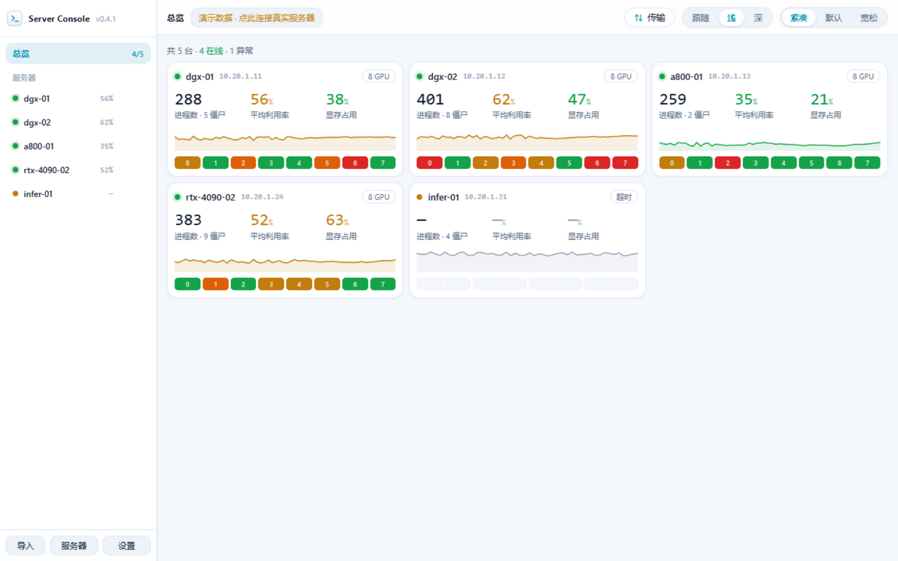
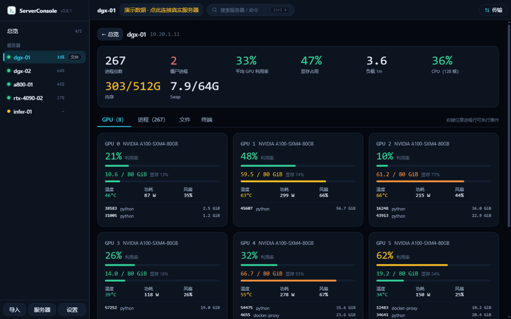

<div align="center">

# 🖥️ ServerConsole

### 一台桌面管理整个 GPU 机房：监控、文件、服务器互传——全程 SSH，数据不经过任何第三方。


[English](./README.md) | 简体中文

**ServerConsole** 是一款本地优先的桌面应用，把多台 Linux/GPU 服务器集中到一起：
实时 GPU 与进程监控、双面板 SFTP 文件管理、上传下载，以及
**服务器间高速直传**——基于 Electron、React 和 [`ssh2`](https://github.com/mscdex/ssh2) 构建。
无云端、无数据中转：所有连接都从你的本机直接发起。

  <p align="center">
    
  </p>
  <p align="center">
    &nbsp;
    
  </p>
</div>

---

## 📑 目录
- [✨ 特性](#-特性)
- [🧱 技术栈](#-技术栈)
- [🚀 快速开始](#-快速开始)
- [🏗️ 构建打包](#️-构建打包)
- [🧭 使用](#-使用)
- [🏛️ 工作原理](#️-工作原理)
- [🔐 安全与隐私](#-安全与隐私)
- [📁 数据存储](#-数据存储)
- [🧪 开发与测试](#-开发与测试)
- [⚠️ 已知限制](#️-已知限制)
- [📄 许可证](#-许可证)

---

## ✨ 特性

### 🧩 多服务器管理
- **密码 / 私钥**两种认证（支持私钥口令），每台服务器可单独测试连接。
- 凭据使用操作系统密钥链加密存储（Windows DPAPI / libsecret），**永不出本机**。
- 侧栏实时可达性、**分组**、可调采集间隔（1 / 2 / 5 / 10 秒）与 Ctrl+K 命令面板。
- **侧边栏自由拖拽调宽**（180px ~ 480px，双击恢复 224px 默认值，自动记忆）。
- **主/次节点差异化采集调度**：当前查看的节点维持高频监控，未选中的后台节点降频至 ≥8 秒探活，管理几十台机器时大幅节约网络带宽与系统资源。
- 连接可**编辑**（改端口、换密码，留空凭据表示保持不变），删除需确认。

### 🔑 一键导入 `~/.ssh/config`
- 真正的 React 对话框解析 OpenSSH config：主机、用户、端口、`IdentityFile`。
- 可浏览任意 config 文件，统一指定或逐台指定私钥；已存在的主机自动跳过。
- **监听 config 文件变化**：新增/变更/移除都会显示横幅，一键导入或更新；移除的主机绝不自动删除。

### 🧰 运维工具箱
- 每台服务器**内嵌 SSH 终端**（xterm.js）：支持多开会话、Windows 式复制粘贴（右键/Ctrl+C/V/多行粘贴）、切 tab 会话与回滚不丢
- **并行命令**：勾选 N 台同时执行同一命令，分栏实时输出
- **本地端口转发**（等价 ssh -L）：规则管理、重启自动恢复
- **快速命令片段**：服务器页一键执行
- 告警 **Webhook**（钉钉/飞书/企微）、传输**限速**、可选 **MD5 校验**
- 远程文本**编辑保存**原子回传；互传「同步模式」（跳过已有，仅 rsync）
- ProxyJump 跳板机、键盘交互认证（2FA/MFA）、ssh-agent 认证；SSH 压缩；系统托盘
- 配置口令加密导出/导入；GitHub Releases 更新检查

### 📊 真实 GPU / 进程监控
- 总览 KPI：平均 GPU 利用率、显存、CPU、内存、负载、僵尸进程数。
- 每卡**利用率、显存、温度、功耗、风扇**及卡上进程。
- **4卡 / 8卡 / 16卡紧凑矩阵视图**：高密算力节点可一键切换紧凑矩阵，一屏统揽全卡负载与热力。
- 进程表可排序/筛选（按 PID、用户、命令搜索；只看 GPU 进程）。
- 右键进程 `SIGTERM` / `SIGKILL`、复制 PID/命令行、重启服务——需确认并写入**持久化本地审计日志**。
- > 温度、风扇、功耗**直接来自 `nvidia-smi`**。驱动未上报的字段显示 `N/A`——绝不估造数值。

### 🗂️ 双面板 SFTP 文件管理
- **本机 ⇄ 远程**并排面板：**自由拖拽调整左右比例（Splitter）**，双击恢复 50:50 默认平分。
- **专业键盘快捷键**：`Delete` 快速删除、`F2` 重命名当前项、`F5` 刷新面板、`Ctrl+A` 全选、`Esc` 清空选择。
- **文件权限管理（chmod）**：右键可视化修改远程文件/文件夹权限（如 755/644）。
- **拖拽上传**、批量上传下载、递归目录传输——文件夹作为单个任务入队，**边遍历边传**（超大目录不再阻塞）。
- 右键菜单：下载、文本查看、重命名、删除、**压缩为 `.tar.gz`**、解压（tar/zip）、传到另一台服务器。
- 远程目录内文件名搜索；双击进入目录；Ctrl 多选、**Shift 范围选**。

### ⚡ 服务器间直传
- 可视化双面板选择源与目标——无需手输路径。
- 优先**服务器直传（数据不过本机）**：探测两端 `rsync / tar / scp`，按优自动选择，失败自动回退；两端都不支持时才走本机中继。
- 使用**运行时生成的一次性密钥对**（注入目标 `authorized_keys`，结束即焚），绝不使用或上传你的主私钥。
- **异常中断自动垃圾回收（GC）**：连接建立后静默清理由于异常掉电或强杀残留的一次性公钥与临时目录。
- 大目录边遍历边流式传输——无阻塞预扫描。
- > 传输**永远是复制**，源服务器上的文件不会被删除；**重试从断点续传**，不删目标端已有文件。

### 🚦 传输中心抽屉
- 常驻顶栏按钮 + 角标，右侧抽屉（可全屏），任务运行时自动钉住。
- 头部实时聚合速度（↑上传 / ↓下载 / ⇄互传）、活跃数、总进度。
- 按类型/状态筛选；展开任务可见：
  - **60 秒瞬时速度曲线**（只显示瞬时值，不做均值造假）；
  - **ETA**（总量未知时明确显示"统计中"）；
  - 完整**源 → 目标路径**（一键复制）；
  - **直传/中继 · rsync/tar/scp** 徽标与能力探测诊断；
  - **文件 x/y 计数**与**最近文件流**（rsync 逐文件回传，可本地过滤）。
- 队列控制：全部暂停/继续、多选取消、失败全重试、清除已完成、**排队任务排序 ↑/↓**、全局**并发 1–15（默认 15）**、系统通知与失败提示音。

### 🎛️ 现代克制的 UI
- 仪表盘风格，**默认清爽浅色**（跟随系统 / 浅色 / 深色）+ 青蓝主色；lucide 线性图标。
- **Windows 自绘标题栏深浅色无缝动态同步**，暗色模式下系统按钮自然沉浸。
- **全界面 10 种语言国际化**（中文简体/繁体、英语、日语、韩语、德语、法语、西语、俄语、葡语）。
- 三档密度（**默认紧凑** / 标准 / 宽松）；主题与密度等设置自动记忆；首帧即正确主题（无闪色）。
- 崩溃自恢复：渲染进程崩溃自动重载，传输在主进程继续。

---

## 🧱 技术栈

| 层 | 技术 |
| --- | --- |
| 壳 | **Electron 44**（主进程 CommonJS） |
| 渲染 | **React 18 + TypeScript (strict) + Vite 5**，手写 CSS 设计 token（无重型 UI 库），图标 lucide-react |
| SSH / SFTP | [`ssh2`](https://github.com/mscdex/ssh2) — 连接、SFTP、exec、密钥 |
| 测试 | **vitest** 单测 + 双假服务器 **e2e 冒烟**（真实 SFTP） |
| 打包 | `electron-builder` — Windows portable/NSIS、macOS dmg、Linux AppImage |

主进程持有全部 SSH/SFTP/本地文件与传输调度；渲染进程只通过受控 `preload` 桥（`window.api`）通信，不直接接触 Node。

### 项目结构
```
.
├─ electron/            # 主进程（CommonJS，checkJs 类型检查）
│  ├─ main.cjs          #   窗口生命周期、单实例锁、崩溃自恢复
│  ├─ preload.cjs       #   受控 IPC 桥 -> window.api
│  ├─ ipc.cjs           #   IPC 处理（服务器、SFTP、传输、通知、审计）
│  ├─ ssh.cjs           #   ssh2 封装：exec/execStream/SFTP + TOFU 指纹校验
│  ├─ sshconfig.cjs     #   解析并监听 ~/.ssh/config（含纯函数 diffConfig）
│  ├─ transfer.cjs      #   队列/并发、直传(rsync/tar/scp)、中继、断点续传、统一树引擎
│  ├─ hostkeys.cjs      #   TOFU 主机指纹信任库
│  ├─ audit.cjs         #   持久化审计日志
│  ├─ localfs.cjs       #   本地文件系统（含删除护栏）
│  └─ store.cjs         #   加密凭据存储（safeStorage + 降级）
├─ src/                 # 渲染进程（React + TS）
│  ├─ App.tsx state.tsx transfers.tsx api.ts types.ts format.ts
│  └─ components/       #   总览、服务器面板、文件管理、互传、导入、抽屉…
├─ tests/               # vitest 单测
├─ scripts/             # 图标生成 + 假 SSH 服务器（含 SFTP）+ 冒烟测试
├─ build/ assets/       # 应用图标
└─ package.json
```

---

## 🚀 快速开始

**要求：** Node.js ≥ 18（开发环境 Node 22）与 npm。

```bash
# 1. 安装依赖
npm install

# 2a. 仅前端（浏览器预览，无主进程能力）
npm run dev

# 2b. 完整桌面开发（Vite + Electron）
npm run electron:dev
```

> Windows PowerShell 下请用 `;` 代替 `&&` 连接命令。

---

## 🏗️ 构建打包

```bash
npm run typecheck      # tsc strict(src) + checkJs(electron)
npm test               # vitest 单元测试
npm run smoke          # e2e 冒烟：双假服务器，真实 SFTP，覆盖采集/上传/下载/互传/队列

npm run dist:win:lite  # Windows 单文件便携版 .exe
npm run dist:win:nsis  # Windows NSIS 安装版
npm run dist:mac       # macOS universal dmg
npm run dist:linux     # Linux AppImage
```

<sub>网络较慢时，可将 `ELECTRON_MIRROR` 与 `ELECTRON_BUILDER_BINARIES_MIRROR` 指向本地镜像。</sub>

---

## 🧭 使用
1. **添加服务器**——填主机/端口/用户，选择密码或私钥认证，可先*测试连接*，再保存；或点**从 `~/.ssh/config` 导入**。
2. 在侧栏选择节点，进入 **总览 / GPU / 进程 / 文件** 标签页。
3. 在**文件**页双面板间上传下载，或勾选远程项 → **服务器互传 ⇄**，在双面板对话框里选目标服务器与目录。
4. 顶栏**传输**按钮随时查看实时速度、文件进度与队列管理。

---

## 🏛️ 工作原理

```
┌────────────────────────────┐         IPC (window.api)          ┌──────────────────────────┐
│  渲染进程(React + TS)       │   ◀──────────────────────────▶  │  主进程 (Node)            │
│  仪表盘 / 文件管理           │                                  │  ssh2 · SFTP · 调度       │
└────────────────────────────┘                                   └───────────┬──────────────┘
                                                                             │ SSH
                                              ┌──────────────────────────────┼──────────────────────────────┐
                                              ▼                              ▼                              ▼
                                        源服务器                        目标服务器                      本地磁盘
```

**服务器间直传的决策过程**

1. 探测源与目标能力（`rsync`、`tar`、`scp`）。
2. 优先**直传**，顺序 `rsync → tar → scp`；逐文件名实时流回（用于 x/y 计数与最近文件流）。
3. 直传不可用时自动回退**本机中继**。
4. 目录总大小与文件数**后台异步统计**，传输立即开始。

---

## 🔐 安全与隐私
- **主机指纹校验（TOFU）**：首次连接记录主机公钥指纹，之后每次连接比对，不一致即拒绝并明确告警；服务器直传会把目标指纹写入源机临时 `known_hosts`（`StrictHostKeyChecking=yes`）。信任库可在 *设置 → 安全* 管理。
- 直传密钥**一次性、用后即焚**；主私钥绝不被复制或上传。
- 中继**只复制不删除**；**重试从断点续传**，不删目标端文件。
- 破坏性操作（杀进程、删文件）需确认，并写入**持久化审计日志**（`audit.log`，重启不丢）。
- 密码使用操作系统 safeStorage 加密；私钥只存*路径*，不存内容。
- 所有指标与进度都来自真实命令返回——**不伪造温度、速度或逐文件进度**。
- 生产构建注入 CSP；本机删除操作对盘根/用户主目录设有硬护栏。

---

## 📁 数据存储
所有本地数据都在系统用户数据目录（Windows 为 `%AppData%/server-console/`）：
`servers.json`（连接）、`transfers.json`（裁剪后的历史）、`hostkeys.json`（TOFU 信任库）、
`security.json`（安全选项）、`audit.log`（操作审计）与 `error.log`。
删除该目录即可完全重置。

---

## ⚠️ 已知限制
- 服务器直传要求两台服务器互相可达；否则自动回退本机中继（受本机上下行带宽限制）。
- 精确逐文件进度需要 `rsync`（或本机中继）；`scp` 兜底模式只有字节级进度。
- GPU 监控要求目标机安装并可执行 `nvidia-smi`。
- 界面已完整支持 10 种语言国际化，可在设置抽屉中随时无缝切换。

---

## 🤝 参与贡献
欢迎 Issue 与 PR。提交 PR 前请运行 `npm run typecheck && npm test && npm run smoke`，并且绝不能提交真实主机、凭据或密钥。

## 📄 许可证
基于 **[MIT License](./LICENSE)** 发布。

<div align="center"><sub>为管理大量 GPU 服务器的工程师而生——传输要快，数据要真，操作要稳。</sub></div>
