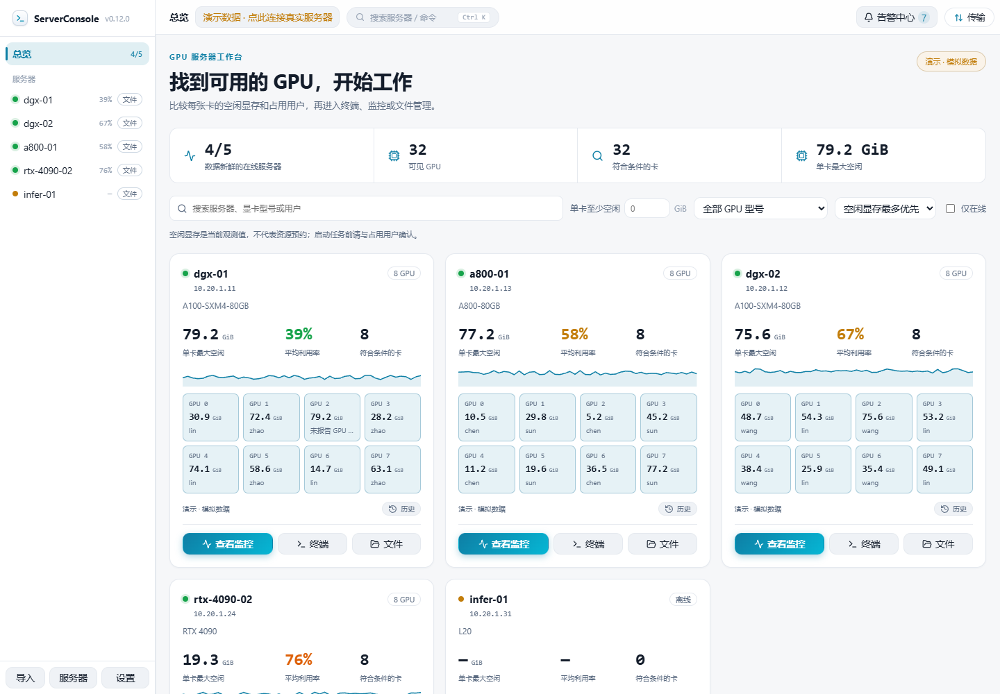

# ServerConsole

**找到显存够用的 GPU，看清占用用户，从一个桌面直接进入终端、监控和文件管理。**

[下载桌面版本](https://github.com/Moguifeng-9119/server-console/releases) · [English](README.md) · [反馈问题](https://github.com/Moguifeng-9119/server-console/issues) · [参与贡献](CONTRIBUTING.md)




*截图来自 v0.11.0，使用明确标注的模拟数据。[v0.11.0](https://github.com/Moguifeng-9119/server-console/releases/tag/v0.11.0) 提供 Windows x64 便携版；其他系统以 Release 的实际附件为准。*

## 适合解决什么问题？

ServerConsole 面向共享 **Linux / NVIDIA GPU 服务器**的科研与工程用户。从本机通过 SSH 连接，集中查看资源、打开终端、管理双栏 SFTP 文件，无需在远端安装监控 Agent。

| 你的任务 | 项目提供的能力 |
| --- | --- |
| 找一张至少空闲 40 GiB 的卡 | 单卡显存筛选、GPU 型号、占用用户搜索、空闲最多优先排序 |
| 看清资源被谁占用 | GPU 与进程信息、用户关联、同一个 PID 的多卡展示、Linux CPU 时间差 |
| 找到资源后开始工作 | 终端/文件快捷入口、SSH config 导入、分组、ProxyJump、快速命令、端口转发 |
| 迁移实验和数据集 | 队列上传/下载、验证断点前缀、跨重启恢复、临时文件替换、rsync 直传或 SFTP 中转 |
| 判断数据是否可信 | 采集时间、过期提示、按真实时间戳绘制且保留缺采样间隔的历史曲线 |
| 追踪异常 | 按服务器与类型归并告警、区分未恢复/已恢复、最多两个可关闭提示；演示模式不发外部异常通知 |

当前定位是个人桌面工作台。团队账户、资源预约、集群调度、AMD/Intel GPU 和完整 NVML 诊断尚未提供。空闲显存是观测值，不代表已预约或可独占。

<p> </p>

## 开始使用

**下载桌面应用：**在 [Releases](https://github.com/Moguifeng-9119/server-console/releases) 选择实际存在的系统附件。有构建脚本不等于已发布并验证对应安装包。进入 **服务器**，先测试连接再添加，或导入现有 SSH config。GPU 指标需要远端可运行 nvidia-smi，系统指标使用 Linux /proc。

**从源码体验界面：**需要 Node.js 22 与 npm。

```sh
git clone https://github.com/Moguifeng-9119/server-console.git
cd server-console
npm ci
npm run dev
```

浏览器里是标明“模拟数据”的演示。真实 SSH、终端、凭据存储和 SFTP 需要桌面主进程：

```sh
npm run electron:dev
```

填写“**单卡至少空闲**”，选择型号或输入用户，再点击 **查看监控 / 终端 / 文件**。设置分为外观、监控、安全、工作流、记录与帮助；Ctrl/Cmd+K 打开命令面板，弹窗支持 Tab、Shift+Tab、Escape 与关闭后焦点恢复。

## 传输与凭据的实际保证

- 任意已有目标文件不再被当成断点。上传、下载和本机中转使用独立任务临时文件，只有完整 SHA-256 前缀一致时才续传。
- SFTP 检查预期字节数和源文件前后的大小/修改时间，通过后才替换目标。不同路径写法与目录/子文件目标冲突会进入队列。失败保留临时文件以便重试；取消/移除清理任务跟踪的临时文件，清理失败则保留记录并显示原因。
- 可选 MD5 在单文件上传/下载**替换目标前**执行，界面明确区分已校验、失败、无法校验、未请求。目录和互传不会冒称已通过 MD5。
- 服务器直传要求两端 rsync 和源到目标的可达性，使用临时密钥与已信任目标指纹。不能直传时回退本机 SFTP；不再使用传输中直接覆盖目标的 tar/scp 回退。
- 安全系统密钥库可用时，密码与私钥口令由 OS 加密保存；不可用或 Linux basic_text 时，新凭据只留在当前会话，重启后需重新输入。安全页显示实际后端与迁移错误；私钥保留在原有路径。

[SECURITY.md](SECURITY.md) 记录完整边界。大小与修改时间检查不能锁住持续变化的源文件；本轮没有把假服务器测试写成真实远程 rsync 验证。

## 开发、测试与构建

```sh
npm run typecheck
npm test
npm run smoke
npm run build
npx playwright-core install chromium  # 无可用本地 Chrome 时
npm run test:ui
npm run benchmark
```

类型检查覆盖严格 TypeScript 前端与 Electron checkJs。smoke 使用假 SSH 服务但真实 SFTP 协议；UI 检查生产构建的浏览器演示并生成截图。本轮还完成 Windows 打包程序的原生 IPC 与本机 SSH shell 检查；运行前需将 SC_ELECTRON_PATH 指向当前解包程序，然后执行 npm run e2e:terminal。基准仅测试本机 10/30 个模拟 SSH 会话，不承诺真实集群性能或节省百分比。

准确依赖版本以 [package.json](package.json) 与锁文件为准。参阅 [本轮改进](docs/IMPROVEMENTS.zh-CN.md)、[本地 Windows 预览](docs/LOCAL_PREVIEW.zh-CN.md)、[架构](docs/ARCHITECTURE.md)、[验证证据](docs/VALIDATION.md)、[基准说明](docs/BENCHMARKS.md)。未配置 ESLint/Hooks lint，不声称该项已通过。

构建命令为 dist:win:lite、dist:win:nsis、dist:linux、dist:mac。[手动打包 CI](.github/workflows/package.yml) 只上传待审查的未签名构建，不自动发布 Release。各平台打包、签名与原生启动需要相应环境验证。

## 语言、贡献与后续方向

保留十种语言选项。新版工作台优先维护英文与简体中文，其他语言新增字符串回退英文；旧页面仍有待翻译部分，见 [国际化状态](docs/LOCALIZATION.md)。

欢迎按 [贡献指南](CONTRIBUTING.md) 提交可复现问题或 PR。查看 [变更记录](CHANGELOG.md)、[路线图](docs/ROADMAP.md) 与 [MIT 许可证](LICENSE)。
