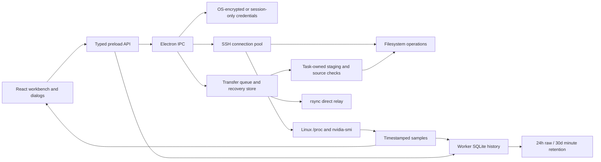

# Architecture

ServerConsole is a local desktop client for Linux/NVIDIA hosts. The renderer never receives stored passwords or private-key contents in the public server list.

## Boundaries

- `src/api.ts` and `src/types.ts`: renderer contracts and public state. `electron/preload.cjs` exposes a bounded IPC bridge.
- `electron/ssh.cjs`: SSH handshake/retry, SFTP channel reuse, command collection and parsing. CPU busy uses `/proc/stat` deltas; process GPU associations retain arrays rather than overwriting a PID with its last card.
- `electron/ipc.cjs`, `poll-scheduler.cjs`: app handlers and independent per-host sampling. Focus requests immediate polling, slow hosts do not block other hosts, and timestamps persist even when percentages are unchanged.
- `electron/history-store.cjs`, `history-worker.cjs`, `history-db.cjs`: bounded worker requests, SQLite persistence, one-time JSON import, clipped time-weighted summaries, bounded queries and periodic expiry/page reclamation. Shutdown flushes accepted writes before quitting.
- `src/state.tsx`, `src/history.ts`, `src/resources.ts`: timestamped history, anomaly records, credential-free display state and single-card resource predicates. Demo IDs are separate from real history IDs; demo samples are not persisted as real observations.
- `electron/transfer.cjs`, `safe-files.cjs`, `task-store.cjs`: queue/target locks, cancellation, safe replacement and execution records. `stage-journal.cjs` commits ownership/cleanup intent before mutation; `transfer-staging.cjs` restores and cleans exact owned paths on reconnect; `resume-verifier.cjs` compares complete prefixes with slower-stream progress and cancellable readers. Display and execution inputs are serialized independently.
- `electron/store.cjs`, `hostkeys.cjs`: OS-encrypted/session credential policy, validated migration, host trust and atomic security preferences.
- `src/hooks/useDialogFocus.ts`: one modal stack drives visual layers and keyboard focus. `workbench.css` shares existing theme tokens and respects reduced motion.

## Transfer state and commit

Tasks progress through queued → running → done/error/paused/canceled. Restarted running/queued tasks become paused and retain server IDs, original paths and staging manifests. Old records without execution inputs display an explicit recovery limitation.

For SFTP paths: inspect source → register task-owned stage → compare resume prefixes → stream remaining bytes → check byte count/source metadata → optional single-file checksum → assert not canceled → rename → remove stage from manifest. Progress at 100% is not sufficient to declare done. Trees commit per file rather than as one transaction.

Targets are normalized; an upload and a relay into the same configured server/path conflict, as do a directory root and a child path. Downloads use both normalized destination locks and task-specific stage names. Failed cleanup retains its record instead of forgetting a large temporary file.

Direct relay has a separate boundary: rsync on the source writes to the destination with a tagged temporary key and trusted host fingerprint. If unavailable, staged local SFTP relays bytes. Direct mode, source consistency and crash cleanup require real-server validation; unit and fake-server tests cover the local fallback.

## Extending it

Keep monitoring collectors separate from rendering and preserve unknown metrics. Add user-facing capabilities through typed API contracts. Add destination-byte regression cases before changing transfer stages, and stacked-dialog browser cases before changing modal behavior. The current backend uses checkJs rather than complete strict TypeScript conversion. Controls and transfer commands have stable contexts; visited file/terminal panes are retained, and unaffected server objects preserve their references. Further performance changes should use profiler evidence.
