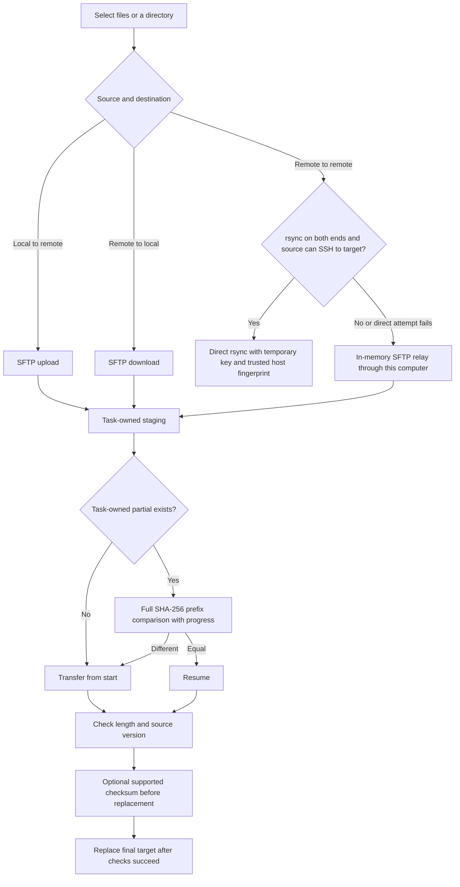

# Usage and recovery guide

This guide expands the README with first-use steps, transfer decisions, staging recovery, keyboard controls and a source map. The [Chinese guide](USER-GUIDE.zh-CN.md) covers the same workflows.

## Start with a connection

Download the artifact for your OS from Releases and check its SHA-256. Open the desktop app, choose Servers, then import an existing SSH config or add and test a connection. Check its address, port, username, key path and host fingerprint. The browser demo uses simulated metrics.

In the overview, filter minimum free GiB **per card**, GPU model and owner. Stale samples do not count as available resources. Open Inspect, Terminal or Files. The file manager shows local files on the left and remote files on the right. Select items before uploading, downloading or opening Server relay. Free memory is an observation, not a reservation.

Remote NVIDIA sampling requires working `nvidia-smi`; system metrics read Linux `/proc`. A successful local Windows GPU query does not establish that the Linux SSH collector can monitor that laptop.

## Transfer decisions



Task details show the method actually used. Direct rsync keeps payload traffic off this computer; relay passes it through this computer. Skip-existing sync mode applies to rsync only.

Directories are discovered while transferring, so totals can grow. Prefix verification still reads the complete saved prefix: resuming a 99 GB partial requires reading those bytes. The new counter shows verification separately from transferred bytes and remains pauseable/cancelable; it does not remove that cost.

## Recovery and disk cleanup

SFTP stages use `<target>.scpart-<task-ID hash>`. An independent ownership journal is durably saved before the first staged write. It records exact paths, recovery inputs and remote endpoint identity. A crash before the debounced task-list save therefore retains enough information to restore the task.

| State or action | Staging behavior |
| --- | --- |
| Pause, error or app crash | Retain a visible recovery task; resume or remove it later |
| Resume | Compare the entire prefix; append only when it matches |
| Success | Check and rename, then release the staging record |
| Cancel or remove | Persist cleanup intent before deleting owned temporary files |
| Offline cleanup | Retain the pending entry and retry after the original server reconnects |
| Host/account/jump configuration changes | Refuse to transfer old ownership to the new endpoint |
| Corrupt journal or disk-write failure | Show an error and preserve the files and records |

GC targets exact owned paths with committed cleanup intent. It never scans an entire server deleting every `.scpart`, and does not expire paused transfers by age. Retained partials occupy disk; cancel or remove obsolete tasks from the transfer center.

Older remote remnants without recorded endpoint identity need manual inspection on the original server. **Forget old record only** removes local metadata and keeps unknown remote files. It must not be interpreted as successful remote cleanup.

Old persisted tasks without execution inputs are paused with a recovery explanation. The previous synthetic recovery error is migrated to this state, while real execution errors remain intact. Create a new transfer in the file manager instead of guessing missing IDs or editing JSON paths.

## Keyboard and text editing

File checkboxes support Space; file-open and actions buttons support Enter. Sorting and load-more controls are buttons. The pane separator supports arrow keys and Home. Dialogs trap Tab/Shift+Tab, close with Escape and restore focus. In relay folder creation, the first Escape closes the inline input and the next closes the dialog.

Unsaved text protects close and navigation. Reloading asks before discarding a draft. Editing and reload controls are disabled during save. Terminal selection and session closing use separate buttons. Ctrl/Cmd+K opens commands when navigation is available.

## Troubleshooting

| Symptom | First checks |
| --- | --- |
| Missing GPU | Run `nvidia-smi` on the remote host; check PATH, container GPU visibility and collection errors |
| Stale metrics | Check sample timestamps and connection errors. Overview polls every node at the configured interval; only a detail view slows background nodes |
| Long prefix verification | Check the verified-byte counter. A large partial requires a full read |
| Resume refused | Check changed sources, missing legacy inputs, changed endpoints and pending cleanup |
| Direct transfer unavailable | Check both rsync installations, source-to-target SSH connectivity and trusted fingerprints; inspect fallback details |
| Credentials requested after restart | Check Security for the OS storage backend; unavailable secure storage keeps new credentials for the session only |
| Cleanup failure | Check the original endpoint, permissions and journal-write errors; inspect only the exact recorded paths |

## Source map

```text
src/App.tsx                    Navigation, global dialogs and draft guard
src/state.tsx / transfers.tsx  Sampling, alerts, settings and transfer subscription
src/resources.ts / history.ts  Per-card predicates and timestamped history
src/components/               Resource, file, terminal, settings and transfer UI
src/hooks/useDialogFocus.ts    Dialog focus and keyboard handling
src/i18n/locales/              Language resources
electron/main.cjs / preload.cjs / ipc.cjs  Desktop lifecycle and IPC
electron/ssh.cjs / sshconfig.cjs           Connection, collection and config parsing
electron/transfer.cjs           Queue and upload/download/direct-transfer orchestration
electron/resume-verifier.cjs    Streaming prefix checks and progress
electron/stage-journal.cjs      Durable ownership and cleanup intent
electron/transfer-staging.cjs   Recovery, identity checks and garbage collection
electron/task-store.cjs / safe-files.cjs  Execution inputs and target replacement
electron/store.cjs / hostkeys.cjs / forwardings.cjs  Credentials, trust and forwarding
tests/                         Behavioral and final-byte regressions
scripts/                       Browser, packaged app and opt-in live acceptance
docs/                          Guides, architecture and evidence
.github/workflows/             Cross-platform checks and packaging
```

After `npm ci`, run `npm run lint`, `npm run typecheck`, `npm test`, `npm run smoke`, `npm run build`, `npm run test:ui` and `npm run test:workflow`. Live acceptance requires explicitly authorized SSH aliases and a new dedicated test directory. See [architecture](ARCHITECTURE.md), [security](../SECURITY.md), [assessment status](ASSESSMENT-STATUS.zh-CN.md) and [release validation](VALIDATION-0.12.0.md).


Publishing: the manual `publish-artifacts` workflow accepts successful package/source run IDs for the same application commit, checks that only release documentation/media/workflows changed, retrieves the tested binaries, normalizes asset names, computes SHA-256 and creates a draft. It does not replace an existing release or automatically make the draft public. Add `docs/RELEASE-vVERSION.md` for the validated tag before dispatch.
