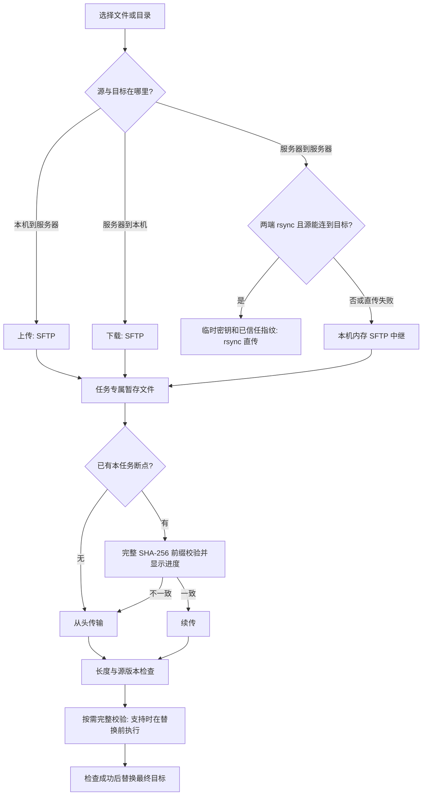

# 使用与恢复指南

这份指南补充 README 首页：第一次连接、文件传输如何选择路径、暂停与崩溃后如何恢复，以及源码入口。

## 第一次使用

1. 从 Releases 下载适合系统的附件，核对 SHA-256。打开桌面应用，进入“服务器”。浏览器演示使用模拟数据。
2. 有 OpenSSH 配置时选择“从 ~/.ssh/config 导入”，检查每台主机的地址、端口、用户名和私钥路径。也可以手动新增，先测试再保存。首次连接核对主机指纹。
3. 回到总览，设置“单卡至少空闲”的 GiB、GPU 型号或用户。显存条件按每张卡判断。数据过期时不会参与可用资源筛选。
4. 打开服务器详情：监控查看 GPU 与进程，终端用于命令，文件页左侧是本机，右侧是远端。共享服务器上的显存观测不代表预约。
5. 文件行有选择框、打开按钮和“⋯”动作。勾选后选择上传或下载；服务器互传弹窗中选择源文件与目标目录，再加入队列。

GPU 采集需要远端 `nvidia-smi` 可运行；系统指标读取 Linux `/proc`。笔记本 Windows 上能运行 `nvidia-smi`，不能单凭这一点认为远端 SSH 的 Linux 采集也已经通过。

## 传输选择流程



任务详情显示实际直传/中继方式。rsync 直传不经过本机；中继数据经过本机。同步模式的“跳过已存在文件”只适用于 rsync，不能把它理解为所有方式均会按内容比较。

目录边遍历边传，大小和文件数会逐渐增加。开始时总量未知属于正常状态，详情中可查看已完成文件。前缀校验仍读取完整断点；例如 100 GB 文件已传 99 GB，恢复需要重新读取这些字节。现在显示校验字节进度，可以暂停或取消，但不声称消除了这部分成本。校验字节不会计入已传输字节。

## 暂存文件、崩溃恢复与清理

SFTP 使用 `<目标>.scpart-<任务ID哈希>`，不拿任意同名目标作为断点。独立所有权日志在首次写暂存文件之前落盘，包含路径、任务执行输入和远端身份。应用崩溃后，即使任务列表的防抖保存尚未完成，也能从日志恢复任务。

| 操作 / 状态 | 暂存文件的处理 |
| --- | --- |
| 暂停、传输错误、应用崩溃 | 保留，并在传输中心展示，方便继续或移除 |
| 继续 | 校验完整前缀；一致才续传，否则从头写本任务暂存文件 |
| 完成 | 完成检查后改名；解除已完成暂存记录 |
| 取消、移除 | 先持久化清理意图，再清理本任务拥有的文件 |
| 清理时断网 | 保留待清理记录；原服务器成功重新连接后重试，失败原因可见 |
| 相同服务器 ID 改了主机、账户或跳板 | 拒绝把旧路径当成新主机文件删除或继续登记；需使用原连接清理，或新建传输 |
| 日志损坏或写盘失败 | 显示错误，停止不可靠的登记/清理，保留现场 |

自动清理仅针对已有所有权证据且明确取消/移除的路径。不会遍历整个服务器删除所有 `.scpart`，也不会凭年龄删除暂停任务。保留的断点会占磁盘：不再需要时，在传输中心取消或移除任务。

旧版本已经遗留但没有端点身份的文件，不能安全地自动认领。可以核对原服务器与具体路径后手动清理；“仅移除旧记录”只删本机任务记录，不删除未知远端文件。不要把这个动作当成远端磁盘回收成功。

## 升级后的旧任务

缺少执行输入的旧任务显示为暂停，并解释“旧版本保存的信息不足以安全恢复”。已经保存的旧恢复提示会迁移成这一状态，不计为新传输失败；真实执行错误仍保留。请从文件管理器新建任务，不要修改 JSON 猜测服务器或目标路径。

## 键盘与文本编辑

- 文件选择框支持 Space，打开和“⋯”按钮支持 Enter；排序和加载更多有按钮。面板分隔条支持左右方向键，Home 恢复等宽。
- 对话框支持 Tab、Shift+Tab 和 Escape，关闭后恢复焦点。新建目录输入中的第一次 Escape 收起输入，再按才关闭互传弹窗。
- 文本有未保存内容时，关闭与导航受到保护；重新读取先确认放弃。保存期间编辑与重读禁用，避免后输入的草稿被错误标为已保存。
- 终端会话切换和关闭是独立按钮；Ctrl/Cmd+K 打开命令面板。

## 常见问题

| 现象 | 先检查什么 |
| --- | --- |
| 看不到 GPU | 远端能否执行 `nvidia-smi`；检查身份、PATH、容器 GPU 可见性和采集错误 |
| 指标暂时不更新 | 采集时间与过期提示；在总览所有节点按配置间隔采集，进入详情才降低后台节点频率 |
| 一直显示前缀校验 | 查看已校验字节是否变化；大断点需要完整读取，不要把校验当成上传进度 |
| 恢复被拒绝 | 源版本是否变化、任务是否旧版缺输入、服务器配置是否已变、清理是否待完成 |
| 无法直传 | 两端 `rsync`、源到目标的 SSH 可达性与可信指纹；详情会记录回退说明 |
| 重启要重新输入密码 | 安全页检查实际系统密钥库；没有安全后端时仅保存会话凭据 |
| 清理一直失败 | 原端点可达性、文件权限、日志写盘错误；只核查本任务列出的文件 |

## 源码布局

```text
server-console/
├─ src/
│  ├─ App.tsx                  页面导航、全局弹窗与草稿保护
│  ├─ state.tsx                连接状态、采样、告警与设置
│  ├─ transfers.tsx            传输订阅与操作
│  ├─ resources.ts / history.ts 资源筛选与真实时间戳历史
│  ├─ components/              工作台、文件、终端、传输与设置界面
│  ├─ hooks/useDialogFocus.ts  弹窗焦点和键盘管理
│  └─ i18n/locales/            十种语言资源
├─ electron/
│  ├─ main.cjs / preload.cjs / ipc.cjs 桌面生命周期与 IPC
│  ├─ ssh.cjs / sshconfig.cjs  连接、采集与 SSH 配置
│  ├─ transfer.cjs             任务调度、上传、下载与直传
│  ├─ resume-verifier.cjs      流式前缀校验与进度
│  ├─ stage-journal.cjs        持久化的暂存所有权与清理意图
│  ├─ transfer-staging.cjs     恢复、身份校验与 GC
│  ├─ task-store.cjs / safe-files.cjs 执行输入与目标替换
│  └─ store.cjs / hostkeys.cjs / forwardings.cjs 凭据、信任与转发
├─ tests/                      状态与最终字节回归
├─ scripts/                    构建、浏览器、原生与受控真机验收
├─ docs/                       指南、架构、验证范围和证据
└─ .github/workflows/          三系统 CI 与打包
```

先运行 `npm ci`，再运行 `npm run lint`, `npm run typecheck`、`npm test`、`npm run smoke`、`npm run build` 、`npm run test:ui` 和 `npm run test:workflow`。真实服务器验收需另行指定授权 SSH 别名，使用独立测试目录；不要把生产目录交给破坏性测试。

参阅 [架构](ARCHITECTURE.md)、[原问题逐项状态](ASSESSMENT-STATUS.zh-CN.md)、[安全边界](../SECURITY.md) 与 [发布验证](VALIDATION-0.12.0.md)。


发布：手动 publish-artifacts 工作流接收同一应用提交的成功源码与打包 run ID，确认应用内容未变，只允许后续发布文档/媒体/工作流修改。它取回已验证附件、计算 SHA-256 并创建草稿，不覆盖现有 Release，也不自动转正式发布。触发前为对应标签准备 docs/RELEASE-v版本.md。
